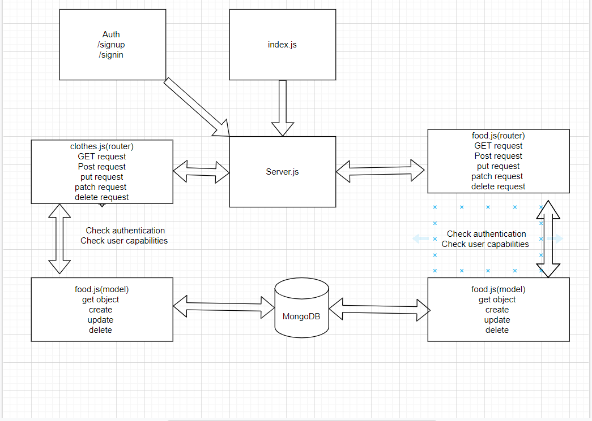

# auth-api

# [heroku](https://auth-api-zaid.herokuapp.com/)
# [PR](https://github.com/zaidalasfar97/auth-api/pull/1)
# [Action](https://github.com/zaidalasfar97/auth-api/actions)

# how to work with this repo:
#### 1-npm init -y
#### 2-npm i express dotenv cors morgan mongoose bcrypt base-64 method-override mongoose supertest jsonwebtoken jest @code-fellows/supergoose

